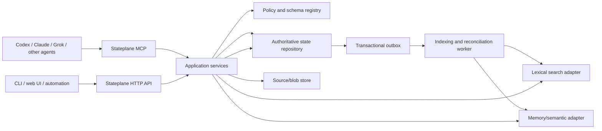

# Stateplane architecture

Status: implementation design, 2026-09-23 (revised same day: queue-as-collection convention, recipes, records-vs-claims rule, narrower v1 slice, §10 defaults). This document describes the product contract; vendor choices below are recommendations behind ports, not hard locks.

## 1. Purpose and boundary

Stateplane gives independently running agents one durable, governed place to put and retrieve shared state. A user or workspace defines the kinds of things to store. Stateplane itself has no built-in knowledge of domains, backorders, tweets, coding projects, or any other customer's workflow.

An agent can define a collection, upsert a record by a stable key, attach an original source, and find the record later by exact query or contextual search. The same contract is available through remote MCP, HTTP, and a small CLI. An agent does not need to know which database, search engine, or memory provider is behind the service.

Stateplane owns **stored state and evidence**. [Skillplane](../skillplane/README.md) owns versioned agent skills and knowledge attached to a skill context. [OMR](../omr/README.md) and other integration runtimes own third-party connections and external actions. Stateplane may record an intended or completed action, but it does not execute that action merely because a record was written. Notion can be an optional view or import/export target, not the authoritative store.

Keep that split permanent in product language: **Skillplane = capabilities; Stateplane = shared mutable world.** Do not rename or blur them in READMEs or MCP descriptions.

### Collections, not a separate queue primitive

A “queue,” “watch list,” “backorder,” or “inbox” is a **collection convention**, not a first-class runtime type. Agents (or humans) define a collection with fields such as a stable `externalKey`, a `stage`/`status` enum, and optional `dueAt` / `priority`. Stateplane stores and queries those records like any other collection. Workflow engines, claim/purchase executors, and cross-agent orchestration remain out of scope; only the durable items and their evidence live here.

### Product requirements

1. Agent-agnostic: a stable remote MCP endpoint, plus equivalent HTTP and CLI operations; no client-specific memory format is authoritative.
2. Domain-agnostic: schemas, uniqueness, allowed fields, and optional lifecycle constraints are workspace data, not hard-coded tools or tables per use case.
3. Exact state and contextual recall: exact lookups come from an authoritative record store; semantic results are derived and always resolved against current authority.
4. Portable providers: product contracts and exported data survive a move from Turso or from a memory vendor.
5. Shared but scoped: every operation is bound to an authenticated principal and a server-resolved workspace, with collection-level policy and auditable writes.
6. Recoverable: retries, concurrent agents, provider outages, deletion, and re-indexing have defined outcomes.

### Initial exclusions

- No general workflow engine, autonomous purchase/action executor, or orchestration of other agents.
- No separate queue/runtime primitive beyond collections of records (see above).
- No arbitrary SQL or user-provided code exposed as an MCP tool.
- No requirement to ingest every chat transcript automatically. Explicit agent writes and separately installed client hooks/importers are distinct mechanisms.
- No promise that vector search alone answers exact status or completeness questions.
- No Notion (or other doc DB) as authoritative store—export/projection only if present at all.

## 2. Architecture and ownership



Only Stateplane application services may combine these ports. The record repository owns canonical IDs, schemas, revisions, source metadata, membership/grants, audit events, tombstones, and the outbox. Blob storage owns large original bytes; the repository owns the immutable digest and pointer. Search and memory providers own rebuildable projections, never the only copy of a user record or source.

The first deployment may use Turso Cloud for the authoritative repository and one provider such as Mem0 or Supermemory for semantic recall. A local SQLite/PostgreSQL repository and a different memory adapter must remain possible without changing the public API. The memory provider is **optional for correctness**: exact reads/writes continue during its outage; contextual search reports a degraded semantic component rather than claiming complete recall.

## 3. Logical data model

| Entity | Durable fields and meaning |
| --- | --- |
| Workspace | Stable ID, name, region/policy settings, lifecycle. Every other entity belongs to one workspace. |
| Principal and grant | User or agent credential identity, workspace role, collection permissions, expiration/revocation. External identity can be supplied by AuthFn. |
| Collection | Stable ID/slug, display name, versioned field schema, uniqueness rules, allowed filters/sorts, retention and indexing policy, owner. |
| Record | Stable ID, collection ID, caller-defined `externalKey` or generated key, validated JSON data, revision, created/updated timestamps, actor and tombstone state. |
| Source | Stable ID, source kind/URI/external ID, capture and observation times, original-content digest, blob pointer or bounded inline content, extraction status, provenance. |
| Link | Typed, workspace-scoped relationship between records, sources, or memories; endpoints remain independently addressable. |
| Memory claim | Optional durable Stateplane claim: text, kind, source references, valid/observed times, revision and review status. Its provider embedding is only a projection. |
| Event and outbox entry | Immutable mutation receipt, actor, before/after revision or digest, idempotency key, projection operation, retry state and timestamps. |

The service has a small **fixed physical schema** for these entities. User-defined collections are rows in the schema registry; user-defined records are validated JSON plus indexed system columns. Do not create a new database table or MCP tool for every user collection. This keeps creation cheap and the MCP catalog stable. If query volume later warrants materialized/indexed fields, generate only allowlisted indexes with an online migration plan; the logical API remains unchanged.

### Collection schema contract

- Versioned, bounded JSON Schema subset: scalar strings/numbers/booleans, dates in an explicitly documented ISO format, arrays/objects with size/depth limits, required fields, enums, and optional field descriptions. Reject unsupported keywords rather than silently ignoring them.
- A collection declares normalized uniqueness keys (`externalKey` at minimum), filterable/sortable fields, and whether updates require review or an expected revision. Apply uniqueness inside a workspace and collection.
- Existing records retain the schema version under which they were accepted. A schema change is a new version with a compatibility check and a migration/revalidation job where needed; rejecting incompatible writes is preferable to silently coercing old data.
- Collection definitions are data, but changing a definition is privileged and audited. An agent with record-write access does not automatically get schema-admin access.
- Relationships use stable IDs and explicit types. Deletion policy (restrict, detach, or cascade) is declared and enforced by Stateplane, not inferred by a memory model.

### Collection recipes (optional starters)

`collection_define` remains privileged and audited. To stop agents from inventing incompatible shapes for the same job, Stateplane may ship a small set of **optional recipes**—named starter schemas the caller can adopt or fork. Recipes are data templates, not hard-coded product tables or MCP tools.

Suggested v1 recipes (names illustrative):

| Recipe | Intent | Typical fields |
| --- | --- | --- |
| `queue_like` | Work items with lifecycle | `externalKey`, `stage` (enum), optional `priority`, `dueAt`, `assignee`, `notes` |
| `watch_list` | Things to monitor | `externalKey`, `stage`, `reviewAt`, optional `sourceRef` |
| `event_log` | Append-ish observations | `externalKey` or generated key, `observedAt`, `kind`, `payload` (bounded object) |
| `freeform` | Minimal | `externalKey` optional; open but still size-bounded JSON under an empty/default field schema |

Adopting a recipe still creates an ordinary versioned collection. Later schema changes use the same compatibility rules as a hand-written definition. Workspaces may ignore recipes entirely.

### Records vs claims (tool-facing rule)

Publish this rule in MCP/HTTP descriptions and keep it stable:

- **Status, completeness, membership, and “is it in X?” → records** (exact query on the authoritative store).
- **Narrative, preference, rationale, and soft recall → claims** (and semantic projections of claims/sources).
- Never answer exact status or completeness from claims or vector search alone. Hybrid `context_search` may *surface* candidates; the application always re-reads records for authoritative fields.

Example configuration, supplied by a workspace rather than shipped as product logic:

```json
{
  "collection": "candidate_domains",
  "version": 1,
  "uniqueBy": ["externalKey"],
  "fields": {
    "domain": { "type": "string", "required": true },
    "stage": { "type": "string", "enum": ["watch", "candidate", "queued", "closed"] },
    "reviewAt": { "type": "string", "format": "date-time" }
  },
  "filterable": ["domain", "stage", "reviewAt"],
  "sortable": ["reviewAt", "updatedAt"]
}
```

The example is deliberately optional. Any workspace can create a different collection without a deployment.

### Relational repository baseline

A SQL implementation can use fixed tables such as `workspaces`, `grants`, `collections`, `collection_versions`, `records`, `record_unique_keys`, `record_field_index`, `sources`, `links`, `claims`, `change_events`, `idempotency_receipts`, `projection_outbox`, and `projection_receipts`. Table names are an implementation detail, not the public data model. `records` stores bounded canonical JSON and a monotonic revision; `record_unique_keys` atomically reserves normalized user-defined unique values within `(workspace_id, collection_id, constraint_name)`. `record_field_index` stores only declared filter/sort fields with explicit value types. Query compilation accepts the declared field/operator pairs and always includes workspace and collection predicates. Updates use conditional revision writes inside the same transaction as unique-key changes, audit, and outbox insertion. An adapter that cannot prove these invariants cannot serve as the authoritative repository.

## 4. Provider-neutral ports

Define these interfaces in Stateplane's domain package. They express product guarantees rather than mirroring a vendor SDK or `@superfunctions/db` method-for-method.

```ts
type Scope = { workspaceId: string; actorId: string; credentialId?: string };
type Ref = { kind: "record" | "source" | "claim"; id: string };

interface StateRepository {
  transact<T>(scope: Scope, fn: (tx: StateTransaction) => Promise<T>): Promise<T>;
  getRecord(scope: Scope, id: string): Promise<RecordSnapshot | null>;
  queryRecords(scope: Scope, query: BoundedRecordQuery): Promise<CursorPage<RecordSnapshot>>;
  getSource(scope: Scope, id: string): Promise<SourceSnapshot | null>;
  listEvents(scope: Scope, query: BoundedEventQuery): Promise<CursorPage<ChangeEvent>>;
}

interface StateTransaction {
  createOrReviseCollection(input: CollectionChange): Promise<CollectionSnapshot>;
  upsertRecord(input: ValidatedRecordWrite & {
    expectedRevision?: number;
    idempotencyKey: string;
  }): Promise<MutationReceipt>;
  putSourceMetadata(input: SourceMetadataWrite): Promise<MutationReceipt>;
  putClaim(input: ClaimWrite): Promise<MutationReceipt>;
  deleteRef(input: { ref: Ref; expectedRevision: number; idempotencyKey: string }): Promise<MutationReceipt>;
  enqueueProjection(input: ProjectionEvent): Promise<void>;
}

interface BlobStore {
  put(input: { workspaceId: string; bytes: AsyncIterable<Uint8Array>; digest: string; mediaType: string }): Promise<{ key: string }>;
  get(input: { workspaceId: string; key: string }): Promise<AsyncIterable<Uint8Array>>;
  delete(input: { workspaceId: string; key: string }): Promise<void>;
}

interface SemanticIndex {
  upsert(input: { workspaceId: string; ref: Ref; revision: number; text: string; metadata: Record<string, string> }): Promise<void>;
  remove(input: { workspaceId: string; ref: Ref; revision: number }): Promise<void>;
  search(input: { workspaceId: string; query: string; limit: number }): Promise<Array<{ ref: Ref; score?: number }>>;
  health(): Promise<{ available: boolean; capabilities: string[] }>;
}

interface LexicalIndex {
  upsert(input: { workspaceId: string; ref: Ref; revision: number; fields: Record<string, string> }): Promise<void>;
  remove(input: { workspaceId: string; ref: Ref; revision: number }): Promise<void>;
  search(input: { workspaceId: string; query: string; limit: number }): Promise<Array<{ ref: Ref; score?: number }>>;
}
```

These are design sketches, not a promise to reuse exact TypeScript signatures. Implementations must pass one shared conformance suite: scope isolation, unique keys, atomic revisions and outbox, retry receipts, cursor stability, stale-write rejection, tombstone behavior, and re-index/rebuild. A provider adapter declares supported capabilities; unsupported required guarantees fail at startup, not at the first production write. Avoid a lowest-common-denominator interface that silently drops constraints.

The Turso adapter should use its supported transaction/driver contract directly behind `StateRepository`. A later Postgres adapter can implement the same port. The Mem0/Supermemory adapter should translate Stateplane refs and workspace scopes to provider IDs/tags and persist the mapping in the authoritative repository. Never expose a provider ID as the only public identity. A no-op semantic adapter is valid for local tests or explicit lexical-only deployments, and must report degraded capabilities.

## 5. Public operations

MCP tools and HTTP routes call the **same** application services. Keep a fixed, bounded MCP catalog rather than dynamically publishing one tool per collection. The CLI is an HTTP client, not a separate persistence path.

| Operation | Required behavior |
| --- | --- |
| `spaces_list` / `space_select` | Discover authorized spaces; selection is client state, but every call still carries a server-authorized workspace. |
| `collections_list` / `collection_get` | Discover schema, filterable fields, and version before a record write. |
| `collection_define` | Create or revise a schema with an expected version; restricted to schema administrators. |
| `records_get` / `records_query` | Exact ID/key lookup and bounded typed filters, sort, and cursor. Results show revision, source refs, and projection status. |
| `records_upsert` / `records_delete` | Schema validation, unique key, idempotency key, expected revision for updates/deletes, transactional audit/outbox receipt. |
| `sources_ingest` / `sources_get` | Store original content or a reference with capture metadata/digest; process extraction asynchronously. |
| `claims_put` / `claims_revise` | Write attributed, source-linked memory claims. Do not treat generated claims as verified facts by default. Claims must not be used as the source of truth for record status or queue membership. |
| `context_search` | Hybrid exact/lexical/semantic candidate retrieval; re-read and re-authorize every returned ref, include provenance and degraded-state metadata. Exact status fields come from the re-read record, not from the semantic hit text. |
| `context_bundle` | Bounded, cited context for a task using explicit workspace, query, token/byte budget, and source references. Prefer linking record refs for authoritative state; claims/sources are citations and rationale. |
| `events_list` / `projection_status` | Inspect history, pending indexing, and failures without exposing secrets. |

All write results return canonical IDs, revision, idempotency receipt, and indexing state as structured fields. MCP descriptions/annotations must identify reads, writes, and destructive operations accurately. Host approval settings are helpful but are not an authorization boundary.

MCP `sources_ingest` accepts small bounded text or a source reference/upload handle. Large or binary originals use a streaming HTTP upload (or a short-lived upload grant) followed by an MCP finalize call. Do not pass large base64 documents through a tool argument or retain them in model context.

Every list/search operation has a maximum limit and opaque, scope-bound cursor; no offset scan of an unbounded collection. Filters and sort names are checked against the collection definition. Free-form JSON filter operators, raw SQL, unrestricted joins, and arbitrary provider search syntax are not exposed.

## 6. Write, ingestion, search, and deletion flows

### Record write

1. Authenticate credential; resolve workspace and actor on the server; evaluate collection permission.
2. Resolve collection schema version and validate size, fields, uniqueness key, and expected revision.
3. In one repository transaction: write record/revision, append audit event, reserve idempotency receipt, and enqueue projection event. Return the committed receipt even if indexing is delayed.
4. Worker projects the current revision to lexical and semantic indexes. It records provider IDs and completion/failure separately. Older queued revisions cannot overwrite newer projections.

### Source ingestion

1. Accept bytes or a referenced original with an explicit source kind, stable external ID, observation/capture times, MIME type, and ownership. A URL alone is not proof that content was fetched.
2. Stream bounded bytes to `BlobStore`, verify digest, then commit source metadata and outbox event. Reconcile orphaned blobs after failed metadata commits.
3. Parser jobs produce text and candidate claims with parser version and source offsets/links. Raw source is immutable; corrected extraction is a new version. Human/agent review can promote a candidate claim.
4. Importers for X, Notion, files, and other systems live outside the core. They use normal ingestion APIs and idempotent external IDs; their provider credentials remain in their integration runtime.

### Search and context assembly

1. Exact record queries read the repository only.
2. Context search gathers candidates from lexical and semantic adapters, merges/deduplicates by canonical `Ref`, then re-reads them from the repository.
3. Apply current workspace grants, record visibility, tombstones, source status, and revision checks **after** retrieval. Discard stale or unauthorized provider hits. Return source IDs, observed/captured times, confidence/review status, and a clear indication when semantic indexing is pending or unavailable.
4. `context_bundle` selects within a caller budget and cites canonical refs. Source text is data, never trusted instructions for the agent.

### Forget/delete

A delete creates an authoritative tombstone and revokes retrieval immediately. It then enqueues removal from indexes and blobs according to retention policy. Search's authoritative re-check prevents a stale index from resurfacing deleted content. Hard erasure, backup expiry, and provider deletion receipts need separately documented retention guarantees; do not equate an index delete response with complete erasure.

## 7. Security and operations

- Hosted MCP uses Streamable HTTP and bearer/OAuth authorization; local stdio may be a thin authenticated client of the same service. Scope is derived from the credential, never accepted from model-controlled tool arguments. Support revocable agent credentials for headless clients and interactive user OAuth for human-operated clients.
- Workspace membership and collection grants are authoritative in Stateplane. Provider tags are defense-in-depth routing hints, not authorization. Separate `schema:write`, `records:read`, `records:write`, `sources:write`, `claims:write`, and administrative/export/delete scopes.
- Keep backend API keys server-side. Encrypt stored connection material; never place it in source text, MCP results, logs, or a client-side configuration that will be shared.
- Rate limit by workspace and credential; bound body size, blob size, query complexity, extraction budget, context output, and provider timeouts. Emit stable error codes (`SCHEMA_INVALID`, `CONFLICT`, `FORBIDDEN`, `INDEX_PENDING`, `PROVIDER_UNAVAILABLE`, etc.) with no credential-bearing exception text.
- Record actor/credential ID, operation, canonical ref, version, time, and outcome. Preserve audit history without storing unnecessary raw source content in logs.
- Backup and export the authoritative database and blobs in an open manifest format. Rebuild lexical and semantic projections from them. Test restore and cross-provider export/import before claiming portability.
- Expose health for repository, blob store, worker lag, lexical index, and semantic provider separately. Alerts should distinguish authoritative write failure from delayed or degraded recall.

## 8. Superfunctions reuse and upstream work

Assessment is from the local `superfunctions-dev` checkout on 2026-09-23 (`droid/datafn-stable-release-20260920`). This checkout has an unrelated untracked `filefn/server/eng.traineddata`; Stateplane work must not alter it. Package publication and consumer compatibility require verification during implementation. Local source contracts are linked below.

| Component | Reuse now | Stateplane boundary / gap |
| --- | --- | --- |
| [McpFn](../../../superfunctions-dev/mcpfn/README.md) `@mcpfn/core`, `@mcpfn/auth`, `@mcpfn/testing` | Build the fixed MCP registry, Streamable HTTP server, structured results, OAuth resource wrapper, manifests, semantic scenarios, conformance checks. | Stateplane owns tool meanings and authorization. No McpFn change required for v1. |
| [AuthFn](../../../superfunctions-dev/authfn/core/README.md) plus [API keys](../../../superfunctions-dev/authfn/docs/content/docs/plugins/api-keys.md) | User sessions, scoped/revocable credentials and provider authentication where its storage adapter is qualified. | Stateplane owns spaces, membership, collection policy, and the mapping from AuthFn principal to workspace grants. Do not treat an API-key scope string as a complete authorization check. |
| [DataFn](../../../superfunctions-dev/datafn/server/README.md) and [DB adapters](../../../superfunctions-dev/packages/db/README.md) | Useful for fixed application tables or a UI read model if its current adapter passes the required transaction/isolation tests. | DataFn's declared physical resource schema does not by itself implement runtime user-defined collections. `@mcpfn/datafn` intentionally exposes a fixed allowlist, so it is not the public dynamic collection API. |
| [MemoryFn](../../../superfunctions-dev/memoryfn/typescript/README.md) | A potential **local/self-hosted semantic adapter** behind `SemanticIndex`. It already has scoped memory, update revisions, forgetting, and injectable storage/provider interfaces. | The dev candidate is unpublished relative to its same-version registry package. The factory supports OpenAI and bundled PostgreSQL (1536-dimensional vectors); SQLite needs a supplied adapter. Extraction can partially commit a multi-fact batch; redaction/limits are unsupported. Do not make Stateplane's public contract equal to MemoryFn's types or mount its two-tool MCP as Stateplane's API. |
| [SearchFn](../../../superfunctions-dev/searchfn/adapter-contracts/src/index.ts) | Optional lexical projection and adapter conformance precedent. | Current search contract returns candidate IDs/scores and is not a source of authorization or semantic memory; Stateplane re-reads and filters. |
| [FileFn storage](../../../superfunctions-dev/packages/storage/src/types.ts) | Consider its storage adapters for large source originals after proving stream, digest, lifecycle, and hosting compatibility. | Source provenance, immutability, and record links remain Stateplane-owned. A simple product `BlobStore` port is sufficient initially. |
| [PlugFn](../../../superfunctions-dev/plugfn/README.md) / OMR | Importer credential and external integration execution may reuse these runtimes. | Ingestion enters Stateplane through its API; Stateplane does not become a general provider connection manager. |

### Proposed upstream changes, ordered by necessity

**No Superfunctions change is a prerequisite for a first product slice** if Stateplane owns `StateRepository` and provider adapters. Reuse McpFn/AuthFn at their existing boundaries and qualify exact packed versions before delivery. Avoid altering Superfunctions just to hide a product-specific abstraction.

1. **Required only if Stateplane chooses `@superfunctions/db`/DataFn for Turso writes:** implement and conformance-test a libSQL/Turso-compatible adapter with real asynchronous transactions, conditional revision updates, unique-key conflict behavior, cursor/date ordering, and namespace isolation. The current Drizzle SQLite branch explicitly rejects async `transaction()` and advertises transactions as unsupported ([source](../../../superfunctions-dev/packages/db/src/adapters/drizzle/index.ts)). A generic CRUD adapter without these guarantees cannot safely host Stateplane's record+audit+outbox transaction. A Stateplane-owned Turso repository avoids this upstream dependency for v1.
2. **Required only if MemoryFn becomes a supported backend:** publish/qualify the hardened local MemoryFn contract, then provide a supported provider/storage injection path, deterministic caller-owned external references, scoped read/write/delete conformance, deletion receipts, and batch reconciliation semantics. Its current storage interface is available ([source](../../../superfunctions-dev/memoryfn/typescript/src/storage/adapter.ts)), but the factory is provider-specific and the README documents unpublished/unsupported behavior. Stateplane can instead adapt Mem0/Supermemory directly while this is unresolved.
3. **Optional reusable SearchFn improvement:** support a canonical ref/revision and tombstone-aware projection contract or a reusable reauthorization hook. Today SearchFn's adapter interface is a candidate-ID index; keeping the authoritative re-check in Stateplane is acceptable and safer for v1.
4. **Optional DataFn improvement, only if validated by multiple consumers:** a policy-checked runtime schema registry and JSON-record query contract for user-defined collections. This is a substantial new capability, not a small adapter patch. Do not expand DataFn merely to eliminate Stateplane's collection registry.
5. **Optional McpFn/AuthFn ergonomics:** shared examples/tests for workspace-scoped tool authorization, revocation during long-running ingestion, and structured error/receipt outputs. Product policy remains in Stateplane even if reusable helpers emerge.

Any upstream item should be developed and tested in the appropriate Superfunctions branch/worktree, with a published package and external-consumer check before Stateplane upgrades. This document does not authorize modifying `superfunctions-dev` now.

## 9. Delivery sequence and acceptance

| Phase | Deliverable | Gate |
| --- | --- | --- |
| 0. Contract | Domain types, fixed MCP/HTTP operations (records + collections only), schema subset, recipes as data fixtures, port conformance suite, and one client-independent example. | Two independent clients produce the same canonical receipts and exact query results against an in-memory repository. |
| 1. Authoritative state | Turso `StateRepository`, **one workspace**, revocable agent API keys + owner credential, versioned collections (including optional recipes), records, audit, tombstones, idempotency, transactional outbox; HTTP and CLI. | Concurrent upserts, duplicate external keys, stale revisions, replay, transaction failure and restore are proven against a real disposable database. Cross-workspace isolation tests may wait until multi-workspace ships. |
| 2. MCP and identity | McpFn remote endpoint, credential bridge, fixed tools, manifests, local stdio proxy if needed. | A user client and an agent client connect to the same workspace; revoked or under-scoped credentials fail before any repository/provider effects. Run McpFn semantic and protocol suites. |
| 3. Sources and search | Blob/source ingestion, parser job contract, lexical search, one semantic adapter, outbox worker and re-index command, claims API. | A source is traceable to its original, exact record state remains available during provider outage, search never returns a deleted/unauthorized ref, and rebuilding an index yields the same canonical refs. |
| 4. Portability, multi-workspace, UI | Export/import, second authoritative-store or semantic-adapter conformance implementation, team workspaces/grants if needed, minimal collection/record/source browser, optional Notion **export/projection only**. | A provider swap preserves IDs, revisions, provenance, permissions and exact answers; semantic score differences are allowed and surfaced. Notion never becomes authoritative. |

**Narrow first vertical slice (gate before phase 3):** create a collection (hand schema or `queue_like` recipe), insert/update/query/delete its records from two different MCP clients, prove idempotency and revision conflict behavior, and prove a revoked key cannot read or write. No sources, no semantic adapter, and no Notion in this slice. Use example collection names only as test fixtures; no example name appears in the service's runtime branching.

Do not start phase 3 until that slice is boringly solid. Semantic recall and source ingestion are where timelines slip; they must not block agents creating shared watch/backorder-style collections.

## 10. Decisions to settle before implementation

Defaults below are **recommendations for the first private deployment** (many agents, one owner). The logical model still supports team workspaces later without changing public tools.

1. **Hosting and identity — recommend single workspace first.** Ship one workspace, an owner credential, and revocable per-agent API keys with collection-scoped grants (`schema:write` rare; most agents get `records:read`/`records:write` on allowlisted collections, or workspace-wide record write without schema admin). Add personal/team workspaces in phase 4 once the records MCP is stable. The logical model supports both; the first auth test matrix should not.
2. **Turso mode — recommend Turso Cloud with a direct libSQL driver** behind `StateRepository` for v1, after verifying async transactions, conditional revision updates, unique-key conflicts, backup/export, and failure behavior on the target runtime. Prefer a Stateplane-owned adapter over waiting on `@superfunctions/db`/DataFn. Local SQLite remains the conformance/dev stand-in; replica/sync is a later optimization, not a v1 requirement.
3. **Memory provider for the first adapter — recommend Mem0 or Supermemory as a projection only; defer MemoryFn.** Choose between Mem0 and Supermemory by deletion and external-ID behavior, workspace/scope tags, result provenance, re-index throughput, cost, and outage behavior—not recall demos alone. If both are adequate, prefer whichever maps cleanly to Stateplane `Ref` + revision and supports reliable delete receipts. MemoryFn stays a candidate local adapter once published/qualified; it is not on the critical path. A no-op semantic adapter is acceptable through the end of phase 2.
4. **Source retention — recommend tight v1 caps.** Small inline text only on `sources_ingest` via MCP; larger originals via upload grant to a single-region blob store. Default retain originals until explicit tombstone + provider delete receipt; document that index deletion ≠ hard erasure. Exact byte/region numbers are an ops choice but must be written down before phase 3.
5. **Claims policy — recommend attributed + untrusted by default.** Agent-produced claims are stored with actor, source refs, and `reviewStatus=unreviewed`. They may be shared automatically for recall inside the workspace but must not overwrite records or silently replace conflicting claims; show conflicts side by side. Promotion to `accepted` is an explicit human or privileged-agent action. Exact status questions still go to records.

The architecture does not depend on resolving these by changing its public tools. Each choice is made behind a port and proved by conformance tests.

## External provider references

- Turso Cloud and MCP: <https://github.com/tursodatabase/turso-mcp>
- Mem0 platform: <https://docs.mem0.ai/platform/quickstart>
- Supermemory MCP and spaces: <https://supermemory.ai/mcp/>

These links inform candidate adapters; none defines Stateplane's public contract.
